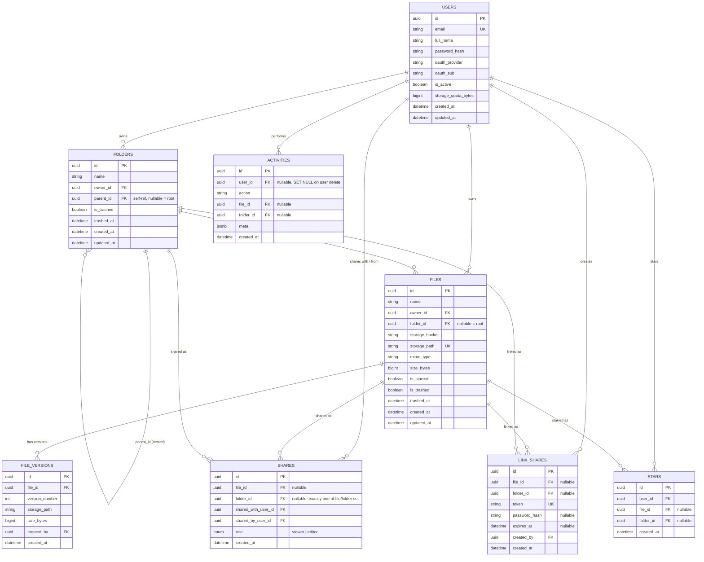

# ER Diagram — Cloud Storage Service (Day 1)

Covers the 8 core tables from the spec (section 6). Renders natively on GitHub.

## Design notes

- **UUID primary keys** everywhere — safe for public URLs (shareable links, signed API responses) without leaking sequential IDs.
- **`folders.parent_id` is self-referencing** (nullable) to give nested folder hierarchy; a `NULL` parent means a root-level folder for that owner.
- **`files.storage_bucket` + `storage_path`** are the pointer into Supabase Storage — the DB never stores file bytes, only metadata + the object path.
- **Soft delete** via `is_trashed` + `trashed_at` on `folders` and `files` (Trash & Restore feature, Day 6) instead of hard deletes.
- **`shares`** has a check constraint requiring exactly one of `file_id` / `folder_id` — a share always targets either a file or a folder, never both/neither.
- **`link_shares`** supports the "public shareable link" feature with optional password (`password_hash`) and optional `expires_at`.
- **`activities`** stores a generic `meta` JSONB blob so new action types (Phase 2 activity log) don't require schema migrations.
- **`file_versions`** is modeled now (Phase 2 feature) so the FK shape is right from day one, even though the version-upload flow isn't built until later.
